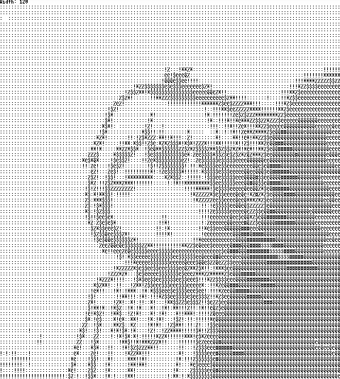
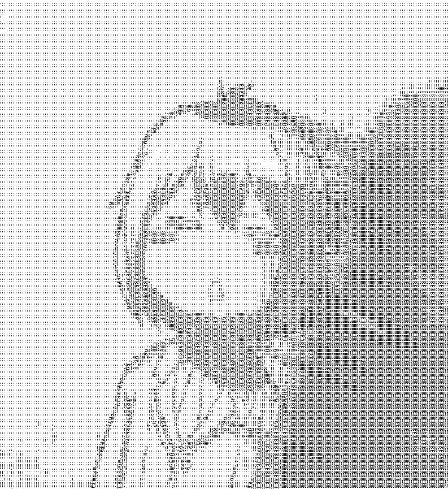

# ASCII Generator 
- ASCII art from image (ASCII Generator in python).
## How to start?
1) Copy the repository
2) Install PIL using 
```python3 -m pip install PIL```
3) Run the program using ```python3 ascii.py```
## Control
```Path:      ```
After launch, we will be greeted by the first input() which requires us to enter the path to our image, including the extension.
Below is an example of entering the path to an image.<br>
```Path: /home/user/pictures/example.png```
<br>
```Width:     ```

##### If after entering the path you did not get any errors, then you did everything right.<br><br>
Next, we have to enter the width of our future ascii image.<br>
As an example, a width of 120 characters and 250 characters will be used.<br>
```Width: 120```<br>
```Width: 250```<br>
<br>The output from the conversions will be shown below.<br>
### Original

### ASCII image with a width of 120 characters.

### ASCII image with a width of 250 characters.

